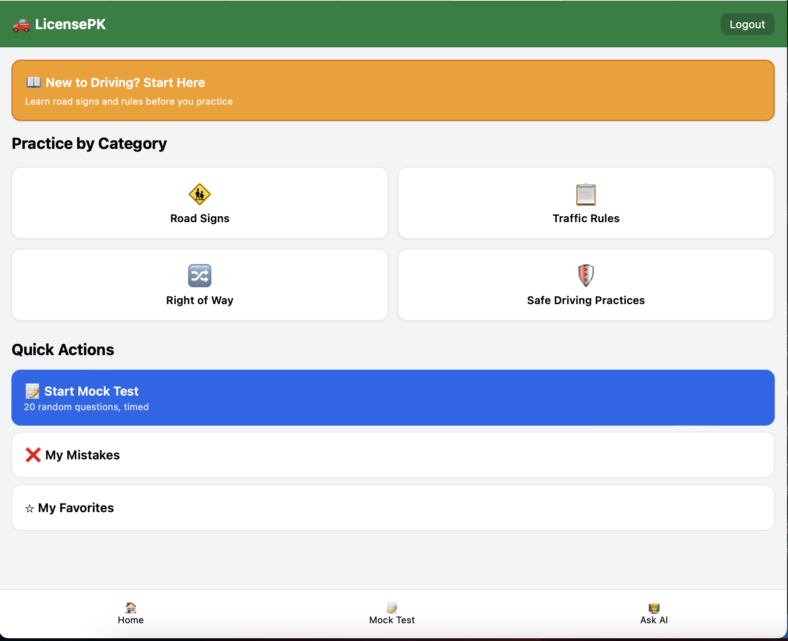
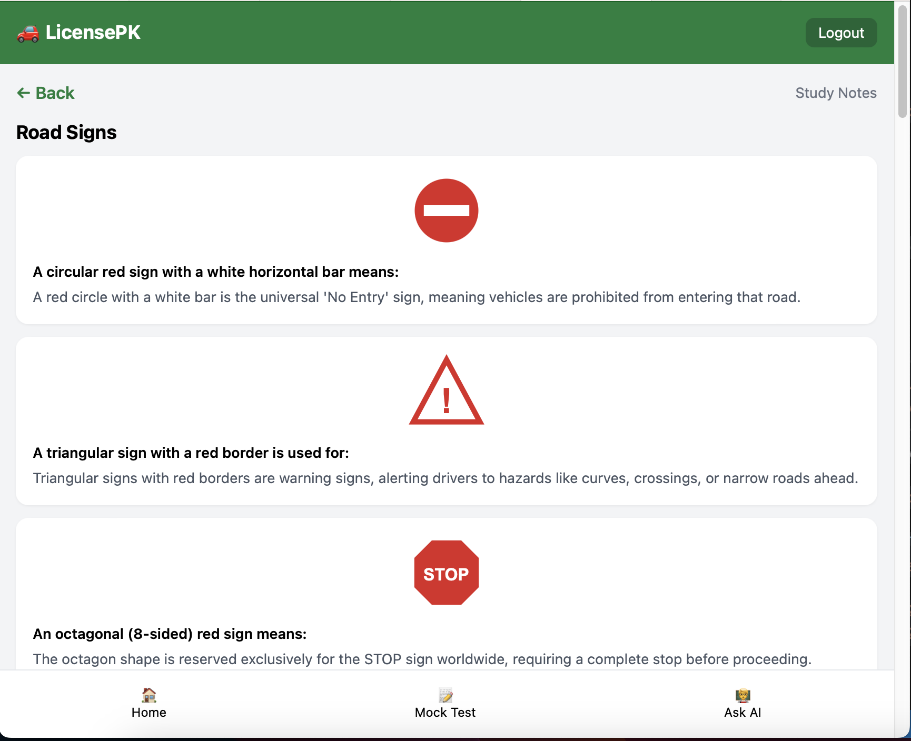
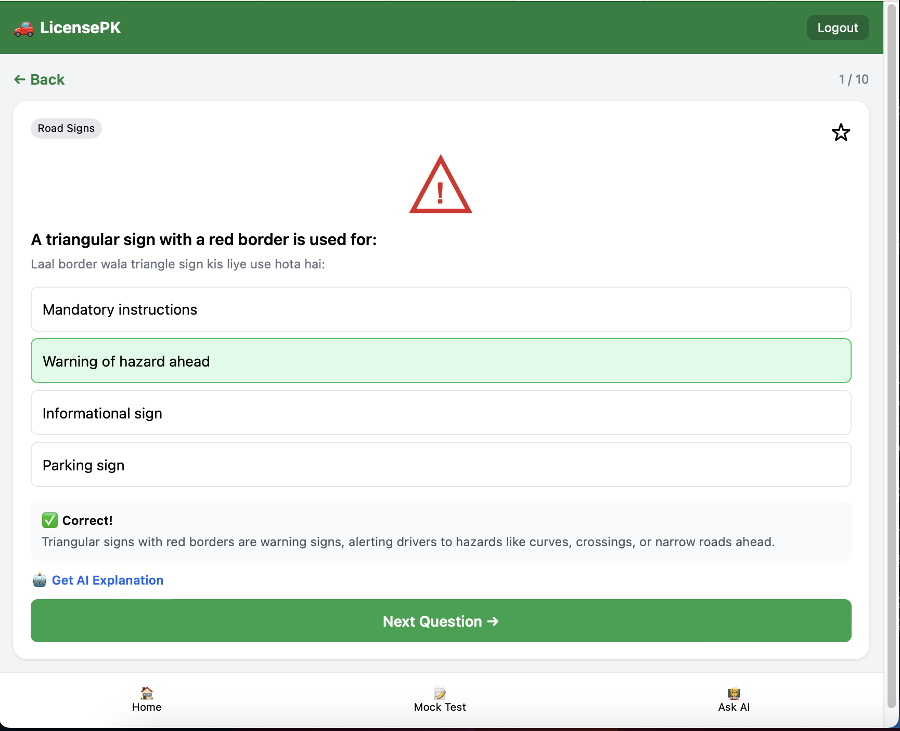
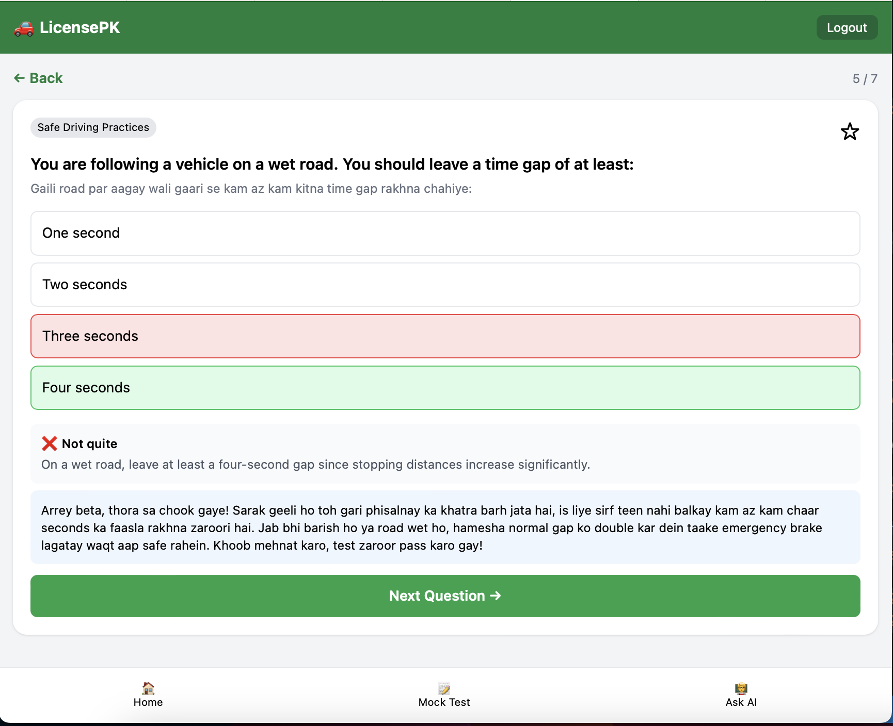
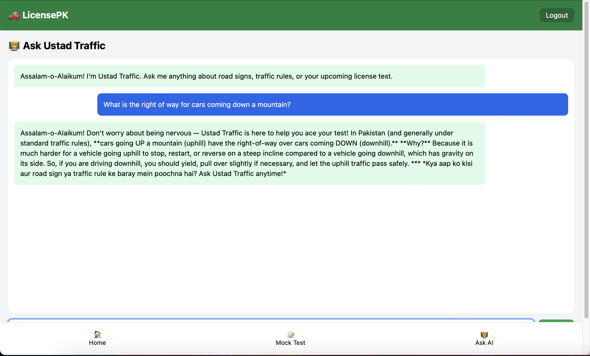

# LicensePK — AI-Powered Driving Test Prep for Pakistan

## What it does & who it's for
LicensePK is a web app that helps people in Pakistan prepare for their learner's driving license test (traffic signs, rules, right-of-way, and safe driving practices). Most people currently prepare using scattered WhatsApp PDFs, unofficial YouTube videos, or no structured material at all. LicensePK solves this with a structured practice system **plus an AI driving instructor** that explains answers and answers free-form questions in English, Urdu, or Roman Urdu/Hinglish.

## Live Demo
🔗 https://license-pk.vercel.app

## Features
- **New to Driving? Start Here** — a beginner-first entry point on the Home screen that opens Study Notes before pushing new users straight into quizzes
- **Study Notes** — a reference view grouped by category (Road Signs, Traffic Rules, Right of Way, Safe Driving Practices), showing each question's explanation and sign icon for review before practicing
- **Road Sign Icons** — original inline SVG icons (Stop, No Entry, Warning Triangle, Mandatory Blue, No Overtaking, Parking, Pedestrian Crossing, Two-Way Traffic, Fuel Station) shown alongside every Road Signs question in Practice, Mock Test, and Study Notes
- **Practice by Category** — Road Signs, Traffic Rules, Right of Way, Safe Driving Practices (shuffled each time, so practice doesn't repeat the same fixed order)
- **Mock Test** — 20 random questions, scored at the end, saved to quiz history
- **My Mistakes** — automatically tracks incorrectly answered questions and lets you retry only those
- **My Favorites** — bookmark tricky questions for later review
- **AI Explanation** — tap "Get AI Explanation" on any question for a personalized, context-aware breakdown of why an answer is right or wrong
- **Ask the Instructor (Ustad Traffic)** — a free-form AI chat tutor scoped to Pakistani driving rules, signs, and test procedure, which also displays the relevant sign icon when it mentions one by name
- **Secure per-user accounts** — Firebase Authentication (email/password), with Firestore security rules ensuring users can only access their own data

## The AI Feature
LicensePK uses the **Google Gemini API** (`gemini-3.5-flash-lite`) in two ways, both called through Vercel serverless functions (`api/explain.js`, `api/chat.js`) so the API key never reaches the browser or the repo.

**1. Context-aware answer explanations** — when a user answers a question, the app sends the question, options, correct answer, and the user's choice to Gemini with this system prompt:

> You are an expert Pakistani Traffic Police driving instructor and examiner. A student is preparing for their learner's driving license test. You will be given a question, its options, the correct answer, and what the student chose. Your job: if correct, briefly reinforce WHY; if incorrect, gently point out the misconception then explain the correct answer. Keep it to 2-4 sentences, practical, no jargon. Match the student's language style (English or Roman Urdu/Hinglish). Never invent specific legal penalty amounts you're unsure of.

**2. Free-form tutor chat ("Ustad Traffic")** — a scoped conversational assistant:

> You are "Ustad Traffic" — a friendly, knowledgeable Pakistani driving instructor chatbot. Scope: ONLY answer questions about Pakistani traffic rules, road signs, driving test procedure, right-of-way, and vehicle documentation. Redirect off-topic questions politely. Always answer in the language the user writes in. Be encouraging — many users are nervous about their test.

This goes beyond a static lookup table — it gives personalized, conversational explanations rather than just showing a pre-written answer key.

## Tools, Services & Models Used
| **Component** | **Technology** |
| --- | --- |
| Frontend | HTML, Tailwind CSS (CDN), Vanilla JS |
| AI Model | Google Gemini API (``gemini-3.5-flash-lite``) |
| Database & Auth | Firebase Firestore + Firebase Authentication |
| Hosting | Vercel (serverless functions for AI calls) |
| Version Control | Git & GitHub |


## Screenshots







## How to Run Locally
1. Clone this repository:
   ```
   git clone https://github.com/YOUR_USERNAME/licensepk.git
   cd licensepk
   ```
2. Open `index.html` and replace the placeholder `firebaseConfig` object with your own Firebase project's config (Firebase Console → Project Settings → Your apps). This is safe to commit — it's not a secret.
3. Set your Gemini key as an **environment variable**, not in the code. In the Vercel dashboard: Project → Settings → Environment Variables → add `GEMINI_API_KEY`. The key is only ever read server-side, inside `api/explain.js` and `api/chat.js`.
4. In your Firebase project, enable **Authentication → Email/Password** and create a **Firestore Database** in production mode. Deploy the included `firestore.rules` file (Firebase Console → Firestore → Rules → paste contents of `firestore.rules` → Publish).
5. Deploy to Vercel and test on the live URL — the `/api` routes only run in a proper server environment (Vercel, or `vercel dev` locally), not by opening `index.html` directly in a browser.

## Notes
- The Gemini API key is never present in any committed file. It's read at runtime from the `GEMINI_API_KEY` environment variable inside two Vercel serverless functions (`api/explain.js`, `api/chat.js`), which the client calls instead of hitting Gemini directly.
- The question bank (`questions.js`) is cross-checked against the official NH&MP (National Highways & Motorway Police) theoretical test syllabus and currently contains a starter set across all 4 categories; it can be expanded further.

## Future Vision & Roadmap
LicensePK is designed as the MVP foundation for a larger planned platform, **Raahi** ("guide" in Urdu) — an AI-powered driving education ecosystem that would extend this project with:
- Visual/image-based sign recognition and spaced-repetition flashcards
- A scenario-based AI tutor that teaches through real driving situations rather than static answer keys
- An adaptive exam simulator that generates a unique mock test per user based on their mistake history and confidence
- A personalized daily study plan generated by AI
- Gamification (XP, streaks, badges) and a "Nearby Services" map for license centers and driving schools
- Multi-country scalability (India, Bangladesh, UAE, Saudi Arabia, UK) via a swappable question-bank/config architecture

A full technical architecture document for this expanded vision has been prepared separately and is planned for future development.

## License
This project is licensed under the MIT License — see the [LICENSE](LICENSE) file for details.

